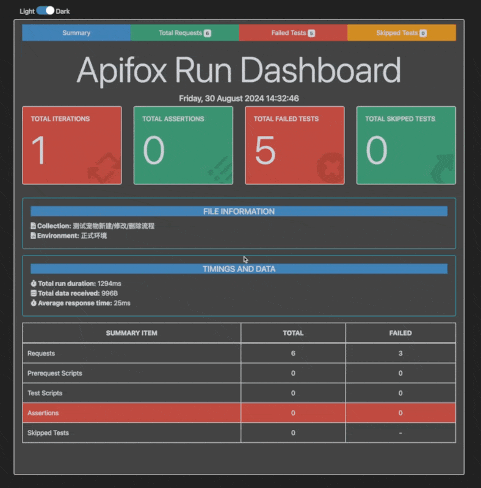

您可以使用 [Apifox CLI](https://www.npmjs.com/package/apifox-cli) 来运行 Apifox 的测试场景并生成 HTML 报告。此报告是一个更好的自定义模板，使测试报告界面和体验更加友好。

此报告模板展示了测试报告中重要信息的概览 dashboard，并以交互方式显示请求的基本信息和详细信息，使用户能够更高效地找到所需信息。

此报告模板基于 [newman-reporter-htmlextra](https://www.npmjs.com/package/newman-reporter-htmlextra) 进行定制开发，感谢作者。

## 报告示例

## 安装
> 这个测试报告模板作为 Apifox CLI 的扩展能力来进行使用，所以请确保已在全局安装好 Apifox CLI。可以使用此命令进行安装：`npm install -g apifox-cli`

通过使用以下命令来安装 htmlextra：
`npm install -g apifox-reporter-htmlextra`

## 用法
为了启用此报告模板，请在 Apifox CLI 的 -r 或 --reporters  命令选项中指定 htmlextra。以下是一个示例命令：
`apifox run --access-token APS-xxxxx -t 123456 -r cli,htmlextra`

报告将在 `./apifox-reports` 目录中创建。如果该目录不存在，则应在您使用 `--out-dir` 命令选项指定的目录中创建。
